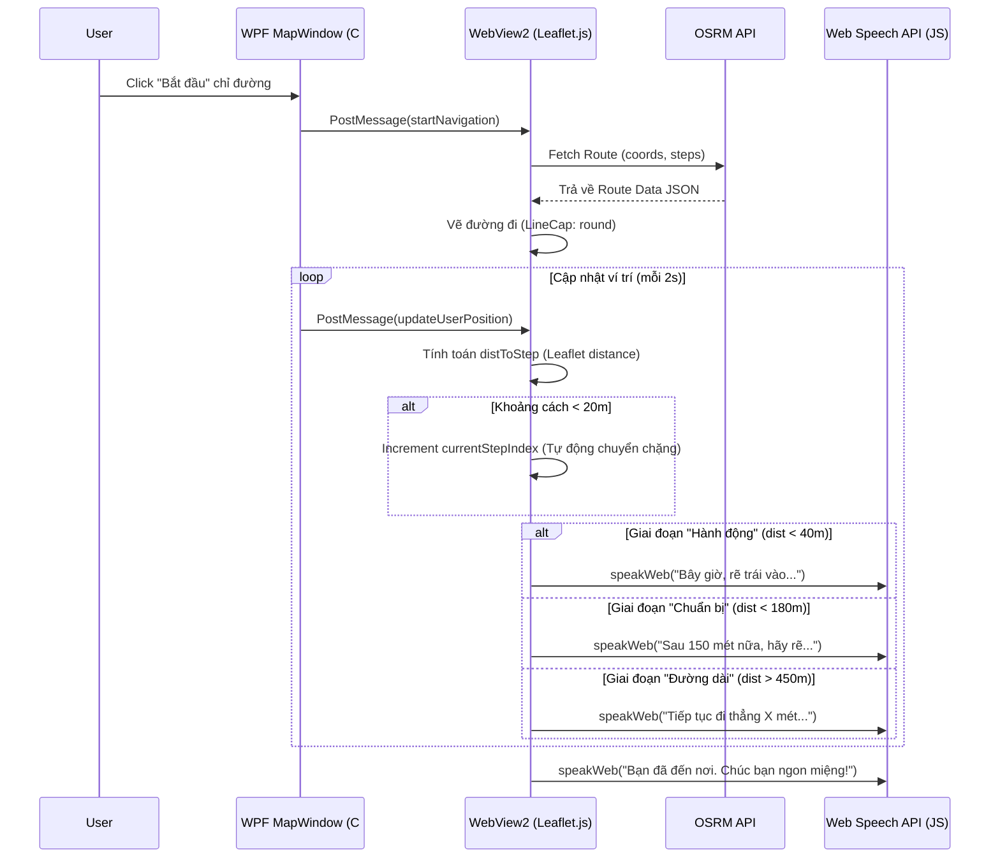

# 🇻🇳 VIETNAM FOOD GUIDE — PRD v2.0 (PREMIUM)

**PRODUCT REQUIREMENTS DOCUMENT & SYSTEM DESIGN**  
*Hệ thống hướng dẫn ẩm thực thông minh với công nghệ dẫn đường giọng nói đa tầng.*

---

| **Thông tin** | **Chi tiết** |
|:---:|:---|
| **Sản phẩm** | Vietnam Food Guide (VFG) |
| **Phiên bản** | 2.0 — Premium Edition (Update 18/04/2026) |
| **Trạng thái** | Đồ án tốt nghiệp / Phản ánh Codebase thực tế |
| **Nền tảng** | C# WPF / .NET Framework 4.8 / WebView2 (Edge Engine) |
| **Công nghệ Voice** | **Web Speech API** (Browser-Native Engine) |

---

## 🗺️ 1. TỔNG QUAN HỆ THỐNG (PROJECT OVERVIEW)

**Vietnam Food Guide** không chỉ là một ứng dụng bản đồ, mà là một hướng dẫn viên ẩm thực "ảo" chuyên sâu cho khu vực Vĩnh Khánh và TP.HCM. Hệ thống tập trung vào trải nghiệm thực tế của người dùng khi đang di chuyển (On-the-go experience).

### 💡 Các giá trị cốt lõi:
- **Chỉ đường thông minh (Phased Navigation):** Hệ thống chỉ dẫn 3 giai đoạn giúp người dùng không bỏ lỡ khúc cua.
- **Thuyết minh tự động (Auto-Guide):** Tự động kể chuyện về các quán ăn khi đi ngang qua.
- **Giọng nói chuẩn Việt:** Sử dụng Web Speech API cho giọng đọc tự nhiên, chuẩn phương ngữ.
- **Hiệu năng cao:** Tối ưu hóa WebView2 và OSRM để tính toán lộ trình trong < 1s.

---

## 📊 2. SƠ ĐỒ USE CASE (SYSTEM USE CASES)

Sơ đồ dưới đây mô tả các tương tác chính của hai tác nhân: **Người dùng (User)** và **Quản trị viên (Admin)**.

```mermaid
usecaseDiagram
    actor "Người dùng (User)" as U
    actor "Quản trị viên (Admin)" as A
    
    package "Hệ thống Vietnam Food Guide" {
        usecase "Đăng ký / Đăng nhập" as UC_Auth
        usecase "Tìm kiếm quán ăn" as UC_Search
        usecase "Xem chi tiết & Thuyết minh" as UC_Detail
        usecase "Chỉ đường bằng giọng nói" as UC_Nav
        usecase "Thuyết minh tự động khi di chuyển" as UC_AutoGuide
        usecase "Quản lý dữ liệu quán ăn" as UC_ManageFood
        usecase "Quản lý người dùng & Phân quyền" as UC_ManageUser
        usecase "Xem báo cáo Thống kê" as UC_Analytics
    }
    
    U --> UC_Auth
    U --> UC_Search
    U --> UC_Detail
    U --> UC_Nav
    U --> UC_AutoGuide
    
    A --> UC_Auth
    A --> UC_ManageFood
    A --> UC_ManageUser
    A --> UC_Analytics
```

---

## 🔄 3. SƠ ĐỒ TUẦN TỰ (SEQUENCE DIAGRAM - NAVIGATION)

Đây là quy trình kỹ thuật "Xương sống" của ứng dụng, mô tả cách WPF, WebView2 và hệ thống Speech tương tác để dẫn đường.



---

## 🛤️ 4. QUY TRÌNH HOẠT ĐỘNG (ACTIVITY DIAGRAM)

Quy trình trải nghiệm người dùng từ lúc bắt đầu đến khi kết thúc hành trình ẩm thực.

```mermaid
activityDiagram
    start
    :Đăng nhập hệ thống;
    :Tìm kiếm quán ăn trên Màn hình chính;
    :Mở Chi tiết quán ăn;
    if (User muốn nghe thuyết minh?) then (Có)
      :Nhấn nút Loa (SpeechService);
    else (Không)
    endif
    :Nhấn "Xem bản đồ";
    :Chọn điểm xuất phát (GPS/Tìm kiếm);
    :Hệ thống vẽ đường đi trên Leaflet;
    :Nhấn "Bắt đầu" chỉ đường;
    repeat
      :Cập nhật vị trí GPS thật/giả lập;
      :Map tự động xoay và zoom;
      if (Ở gần quán ăn khác?) then ( < 40m)
        :Phát thuyết minh tự động về quán đó;
      endif
      :Phát chỉ dẫn giọng nói theo chặng;
    backward:Tiếp tục di chuyển;
    repeat while (Chưa đến điểm đích?)
    :Thông báo "Đã đến nơi";
    stop
```

---

## 🛠️ 5. ĐẶC TẢ KỸ THUẬT CHI TIẾT (TECHNICAL SPECIFICATIONS)

### 5.1. Voice & Navigation Engine (Dual-Core Architecture)
Chúng ta đã chuyển đổi từ kiến trúc server-side sang client-side hoàn toàn để tối ưu độ trễ:
- **Speech Engine:** Web Speech API (`window.speechSynthesis`).
- **Logic Dẫn đường:**
    - **Long Phase:** Chỉ nhắc lại hướng dẫn khi người dùng đi được quãng đường > 350m so với lần nhắc trước.
    - **Preparation Phase (180m):** Đưa ra cảnh báo sớm để người dùng chuẩn bị giảm tốc độ.
    - **Action Phase (40m):** Câu lệnh dứt khoát "Bây giờ, hãy..." để thực hiện rẽ.
    - **Auto-Advance:** Sử dụng logic proximity để tự động nhảy chặng mà không cần can thiệp thủ công.

### 5.2. Công nghệ Bản đồ & UI
- **Leaflet.js:** Tối ưu hóa rendering với `smoothFactor` để đường đi không bị gãy khúc.
- **Viewport Offset:** Tự động đẩy marker người dùng xuống 1/3 phía dưới màn hình để người dùng thấy rõ "con đường phía trước" rộng hơn.
- **Clean Interface:** Loại bỏ hoàn toàn các banner thông báo (Diagnostic Banner) để nhường chỗ cho bản đồ trực quan.

---

## 📈 6. YÊU CẦU PHI CHỨC NĂNG (NON-FUNCTIONAL)

| Nhóm | Chỉ số mục tiêu | Ý nghĩa |
|:---:|:---:|:---|
| **Độ ổn định** | 99.9% Voice success | Web Speech API đảm bảo luôn có tiếng kể cả offline |
| **Độ trễ** | < 200ms Voice trigger | Ngay khi chạm ngưỡng khoảng cách, lệnh thoại phát ra ngay |
| **Hiệu năng** | < 50MB RAM Task | Tối ưu hóa việc xóa cache WebView2 khi không sử dụng |
| **Chính xác** | Sai số < 5m | Sử dụng snapping logic để gắn vị trí người dùng vào vạch đường |

---

## 🚀 7. TÍNH NĂNG MỚI ĐÃ CẬP NHẬT (COMPLETED UPDATES)

> [!TIP]
> **Các tính năng "Xịn" nhất đã được hiện thực:**
> - ✔ **Di cư sang Web Speech API:** Xóa bỏ hoàn toàn lỗi "mất giọng" hoặc "phát âm sai accent".
> - ✔ **Hệ thống dẫn đường 3 giai đoạn:** Cung cấp trải nghiệm như thiết bị GPS chuyên nghiệp.
> - ✔ **Smart Step Advance:** Tự động nhảy chặng khi đến giao lộ.
> - ✔ **Proactive Narration:** Tự động kể chuyện về quán ăn khi đi ngang qua dựa trên rating.

---
**Vietnam Food Guide — Documentation Revision 02 | 2026**  
*Document prepared by Antigravity AI Assistant.*
